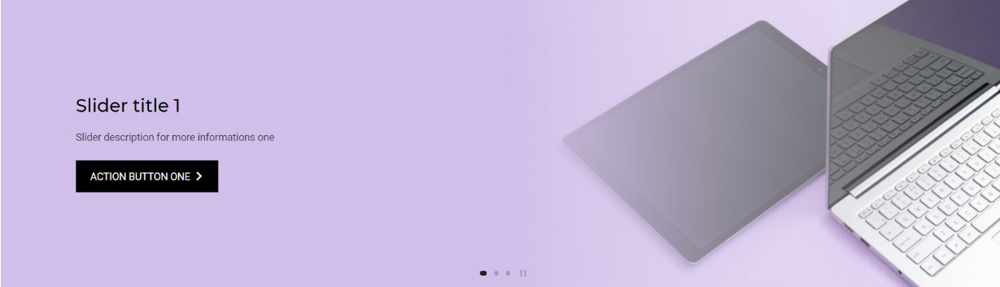

<p align="center">
    
    <h3 align="center">Slider</h3>
    <p align="center">
        Simples, leve e intuitivo. Adicione um toque de elegância ao seu projeto.
        <br>
        <br>
        
    </p>
</p>
<br>

## índice

- [Instalando](#instalando)
- [Arquivos](#arquivos)
- [Estrutura](#estrutura)
- [Instância](#instância)
    - [Objeto de Conteúdo](#objeto-de-conteúdo)
    - [Tempo de transição](#tempo-de-transição)
    - [Array de imagens](#array-de-imagens)
    - [Exemplo da configuração completa](#exemplo-da-configuração-completa)
    - [Preload de imagens](#preload-de-imagens)
- [Design](#design)
    - [Redefinindo largura](#redefinindo-largura)
    - [Cor de fundo do título](#cor-de-fundo-do-título)
    - [Removendo controles](#removendo-controles)

## Começo rápido

Adicione ao seu projeto o arquivo de estilo ``slide.css`` e o arquivo de script ``slide.js``, não esqueça de inserir [jQuery](https://jquery.com/) ao seu projeto. Deve ficar algo parecido com isto:

```html
<!DOCTYPE html>
<html lang="en">
<head>
    <!--Slide estilo-->
    <link rel="stylesheet" type="text/css" href="../slider.css">
</head>
<body>

    <!--Slide estutura-->

<!--jQuery-->
<script type="text/javascript" src="../jquery.js"></script>

<!--Slide script-->
<script type="text/javascript" src="../slider.js"></script>

<!--Scripts de configuração-->
<script>
    // configuração aqui...
</script>

</body>
</html>
```
## Arquivos

A estrutura de pastas e arquivos segue o padrão dos projetos. Caso queria mudar em sua aplicação basta indicar o caminho correto dos arquivos.

```
src/
|__css/
|  |__slider.css
|__img/
|  |__cover.png
|  |__cover2.png
|  |__cover3.png
|__js/
   |__jquery.js
   |__slider.js
```
## Estrutura

A estrutura em HTML do Slider segue um padrão diferenciado. Você passa somente a estrutura absoluta e algumas tags com atributos específicos. Confira abaixo:

```html
<body>

    <!--Slide estutura-->
    <div class="slider-panel">
        <a data-uri>
            <div class="slider-wrapp">
                <div class="slider-content-top"></div>
                <div class="slider-content-left">
                    <button class="slider-btn">
                        <i class="material-icons">keyboard_arrow_left</i>
                    </button>
                </div>
                <div class="slider-content-right">
                    <button class="slider-btn">
                        <i class="material-icons">keyboard_arrow_right</i>
                    </button>
                </div>
                <div class="slider-dots"></div>
            </div>
        </a>
    </div>
    <!--Fim Slide estutura-->

</body>
```
## Instância

Você pode criar uma nova instância da função `` slider(conteudo, tempo) `` passando como parâmetros um objeto que contenha as informações de **conteúdo** e o **tempo de transição** de cada slide. Ou se preferir utilize-a de modo convencional.

### Objeto de Conteúdo

- `` image ``: **Array** contendo as imagens do slide.
- `` title ``: Atribui um título único ao slide.
- `` titleSlide ``: **Array** contendo o título de cada slide.
- `` descriptionSlide ``: **Array** contendo a descrição de cada slide.
- `` uriSlide ``: **Array** contendo o link de cada slide.
- `` textActionSlide ``: **Array** contendo o texto do botão de ação de cada slide.

### Tempo de transição

Neste parâmetro você deve informar a duração em **milissegundos**.

### Array de imagens

Defina um array contendo as imagens de cada conteúdo. Você pode utilizar imagens de URL ou indicar o caminho relativo.

#### Imagens de URL

```javascript
var config = {
    image: [
        'https://site.com/src/img/imagem.png',
        'https://site.com/src/img/imagem.png',
        'https://site.com/src/img/imagem.png'
    ]
}
```
#### Imagens do diretório

```javascript
var config = {
    image: [
        '../img/imagem.png',
        '../img/imagem.png',
        '../img/imagem.png'
    ]
}
```

### Exemplo da configuração completa

```html
<script>

    var config = {
        image: [
            '../img/cover.png',
            '../img/cover2.png',
            '../img/cover3.png'
        ],
        title: '',
        titleSlide: [
            'Título um',
            'Título dois',
            'Título três'
        ],
        descriptionSlide: [
            'Descrição um',
            'Descrição dois',
            'Descrição três'
        ],
        uriSlide: [
            '#link-1',
            '#link-2',
            '#link-3'
        ],
        textActionSlide: [
            'Clique aqui um',
            'Clique aqui dois',
            'Clique aqui três'
        ]
    }

    // slider(config, 5000);
    var slider = new slider(config, 5000);

</script>
```

### Preload de imagens

Adicione esta função e inicialize-a antes de instânciar ou inicializar a função `` slider() `` para ocorrer um pré carregamento das imagens informadas no array de imagens. Faça algo do tipo:

```javascript
function preload(arrayImage) {
    $(arrayImage).each(function() {
        $('')[0].src = this;
    });
}

var config = {...}

// Inicializa a função passando o array de imagens como parâmetro
preload(config.image);

// Inicializa a função slider()
```

## Design

Você pode querer fazer algumas modificações no design. Então de forma fácil entenda seu layout e veja algumas formas de modificar sua aparência.

### Redefinindo largura

#### CSS
```css
.slider-panel {
    margin-right: 0px !important;
    margin-left: 0px !important;
    /* margin-top: 0px !important; */
    /* margin-bottom: 0px !important; */
}
```
#### jQuery
```javascript
$('.slider-panel').css({
    'margin-right': 0, 
    'margin-left': 0
    // 'margin-top': 0,
    // 'margin-bottom': 0
});
```
### Cor de fundo do título

#### CSS
```css
.slider-content-top {
    background-color: rgba(0,0,0,.5);
}
```
#### jQuery
```javascript
$('.slider-content-top').css('background-color', 'rgba(0,0,0,.5)');
```
### Removendo controles

#### CSS
```css
.slider-dots {
    visibility: hidden;
}
```
#### jQuery
```javascript
$('.slider-dots').hide();
```